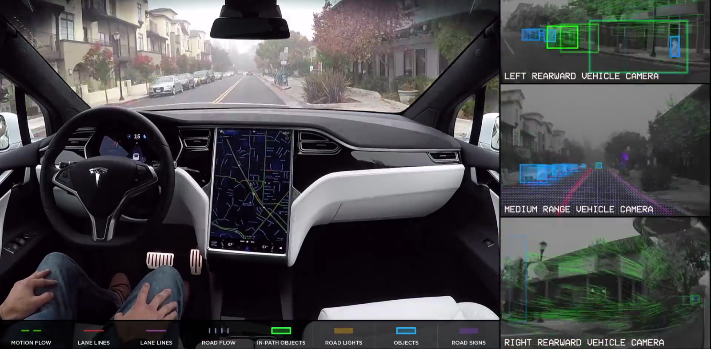

# Self Driving Car Learning Projects

**This Repo respect to Udacity, Coursera, MIT Honor Code.** Some of my projects is inspired by programming assignments from Udacity, Coursera, MIT. And some of the projects that I had finished may out of my personal preference on some particular area, like deep learning, SLAM and Kalman Filter, etc. Some projects may be haven't update to this github repo but will soon finish. Thank you Udacity Faculties and classmates. 

The projects would so far organized in order of terms where it so far mainly based on Udacity self-driving car projects, but will soon add some projects beyond the courses has provided. And some of my codes were totally original.

## Projects Included:

* Machine Learning
* Deep Learning
  * Neural Networks
  * Hyperparameter tuning, Regularization and Optimization
  * Intro to Tensorflow
  * Intro to PyTorch
  * Intro to Keras
  * Classical Networks(LeNet, Inception Networks, GooLeNet, VGG , LSTMs(A LOTS OF LSTMs), GANs(LOTS OF GANs), etc.)
  * [Traffic Light Classification](https://github.com/LimberenceCheng/Traffic-Light-Classifier)
  * [Traffic Sign Classification](https://github.com/LimberenceCheng/self-driving-car-project/blob/master/Term1/Traffic-Sign-Classifier/Traffic_Sign_Classifier.ipynb)
* Computer Vision
* Transfer Learning
* Reinforcement Learning
* [Finding lane lines](https://github.com/LimberenceCheng/self-driving-car-project/blob/master/Term1/LaneLines/P1.ipynb)
* Behavioral Cloning
* Advanced Finding Lane Lines
* Vehicle Detection
* Bayesian Filter
* Extended Kalman Filter
* Unscented Kalman Filter
* Kalman Filter(Using cpp, completed by myself out of curiosity)
* Localization
* Simultaneous Localization And Mapping(SLAM)
* Kidnapped Vehicle
* PID Controller
* Model Predictive Control(MPC)